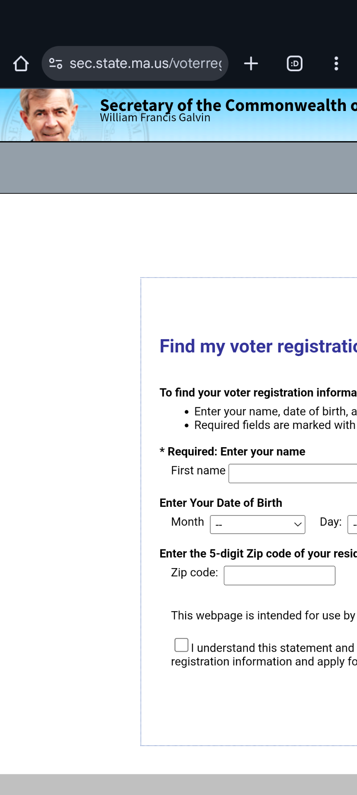
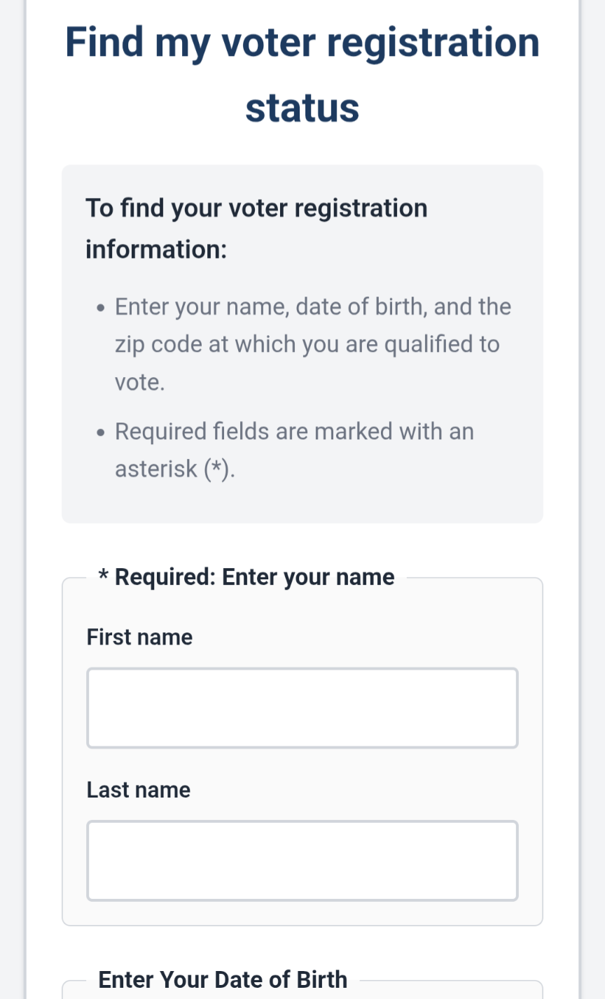

# Massachusetts Voter Registration - Mobile-Friendly Mockup

⚠️ **UNOFFICIAL MOCKUP** - This is a mobile-friendly redesign demonstration of the Massachusetts voter registration search page. For official voter registration information, visit [sec.state.ma.us/voterregistrationsearch](https://www.sec.state.ma.us/voterregistrationsearch/).

## About This Project

This project is a responsive, mobile-friendly redesign of the Massachusetts Secretary of State's voter registration search page. The official page, while functional, is not optimized for mobile devices. This mockup demonstrates how the same functionality could be presented with a modern, mobile-first design.

### Visual Comparison

**Search Page:**

<table>
<tr>
<td width="50%"><b>Original Site</b></td>
<td width="50%"><b>Our Mockup</b></td>
</tr>
<tr>
<td></td>
<td></td>
</tr>
</table>

**Results Page:**

<table>
<tr>
<td width="50%"><b>Original Site</b></td>
<td width="50%"><b>Our Mockup</b></td>
</tr>
<tr>
<td></td>
<td></td>
</tr>
</table>

### Key Improvements

1. **Mobile-First Design** - Optimized for small screens first, then enhanced for larger displays
2. **Native Date Picker** - Uses the device's built-in date picker instead of three separate dropdowns
3. **Responsive Layout** - All elements adapt smoothly from mobile to desktop
4. **Larger Touch Targets** - Buttons and inputs are sized appropriately for touch screens (minimum 44px)
5. **Collapsible Navigation** - Hamburger menu on mobile to save screen space
6. **Better Typography** - Readable font sizes that scale appropriately across devices
7. **Improved Information Hierarchy** - Clear visual organization of voter registration details
8. **WCAG 2.1 AA Compliant Accessibility** - Comprehensive accessibility features exceeding the original site

## Accessibility

This mockup significantly improves accessibility compared to the [official site](https://www.sec.state.ma.us/voterregistrationsearch/), which has [numerous accessibility violations](https://www.accessibilitychecker.org/audit/?website=https%3A%2F%2Fwww.sec.state.ma.us%2FVoterRegistrationSearch%2FMyVoterRegStatus.aspx&flag=us).

### Accessibility Comparison: Original vs. Mockup

| Feature | Original MA Site | Our Mockup | Impact |
|---------|-----------------|------------|---------|
| **Semantic HTML** | Missing landmarks | Full `<header>`, `<nav>`, `<main>`, `<footer>` with ARIA roles | Screen readers can navigate by landmarks |
| **ARIA Labels** | Missing or incorrect | Comprehensive labels on all interactive elements | Screen readers announce element purpose |
| **Keyboard Navigation** | Limited support | Full support + Escape key to close menu | Keyboard-only users can navigate entire site |
| **Focus Indicators** | Weak/invisible | 3px blue outline, 2px offset on all focusable elements | Keyboard users can see where they are |
| **External Links** | No indication | `rel="noopener noreferrer"` + "(opens in new window)" for screen readers | Security + context for assistive tech users |
| **Decorative Images** | No `aria-hidden` | All emojis/icons have `aria-hidden="true"` | Screen readers skip decorative content |
| **Form Labels** | Some missing | All inputs have proper `<label>` elements | Screen readers associate labels with inputs |
| **Fieldsets** | Not used | Grouped inputs with `<fieldset>` and `<legend>` | Logical form structure for assistive tech |
| **Status Updates** | No ARIA live regions | `role="status"` + `aria-live="polite"` on result banners | Screen readers announce registration status |
| **Button States** | No state indicators | `aria-pressed` on language buttons, `aria-expanded` on menu | Screen readers announce button states |
| **Touch Targets** | Too small (<40px) | Minimum 44px per WCAG guidelines | Easier for users with motor disabilities |
| **Color Contrast** | Some failures | WCAG AA compliant throughout | Readable for low vision users |
| **Reduced Motion** | Not supported | `prefers-reduced-motion` media query | Safe for users with vestibular disorders |
| **Mobile Optimization** | Poor responsiveness | Mobile-first responsive design | Accessible on all device sizes |
| **Link Security** | Some `target="_blank"` without `rel` | All external links have `rel="noopener noreferrer"` | Prevents security vulnerabilities |

**Summary**: Our mockup transforms an accessibility-challenged government website into a WCAG 2.1 AA compliant, fully accessible experience that works for users of all abilities across all devices.

### WCAG 2.1 AA Compliance Features

**Screen Reader Support:**
- Skip link for keyboard navigation to main content
- Proper semantic HTML5 elements (`<header>`, `<nav>`, `<main>`, `<footer>`)
- ARIA landmarks (`role="banner"`, `role="navigation"`, `role="main"`, `role="contentinfo"`)
- ARIA labels for all interactive elements
- Screen reader-only text (`.sr-only` class) for context on links opening in new windows
- Decorative emojis hidden from screen readers with `aria-hidden="true"`
- Status banners with `role="status"` and `aria-live="polite"` for dynamic updates

**Keyboard Navigation:**
- Skip to main content link (visible on keyboard focus)
- Full keyboard navigation support for all interactive elements
- Enhanced focus indicators with 3px blue outline and 2px offset
- Escape key closes mobile menu and returns focus
- Proper tab order throughout the page

**Visual Accessibility:**
- High color contrast ratios meeting WCAG AA standards
- Reduced motion support via `prefers-reduced-motion` media query
- Larger touch targets (minimum 44px) for easier interaction
- Clear visual focus indicators for all interactive elements
- Color is never the only means of conveying information

**Form Accessibility:**
- Proper `<label>` elements for all form inputs
- Fieldsets with legends for grouped form controls
- Clear error messaging and validation feedback
- Native HTML5 input types for better mobile experience

**Link Safety:**
- `rel="noopener noreferrer"` on all external links for security
- Clear indication of links opening in new windows
- Descriptive link text and ARIA labels

### Testing Accessibility

You can test this mockup's accessibility using free tools:

**Automated Testing:**
- [WAVE Browser Extension](https://wave.webaim.org/extension/) - Real-time accessibility feedback
- [axe DevTools](https://www.deque.com/axe/devtools/) - Chrome/Firefox extension for accessibility testing
- [Lighthouse](https://developers.google.com/web/tools/lighthouse) - Built into Chrome DevTools (Accessibility audit)
- [Accessibility Checker](https://www.accessibilitychecker.org/) - Online accessibility validator
- [Pa11y](https://pa11y.org/) - Command-line accessibility testing tool

**Manual Testing:**
- Test with keyboard only (Tab, Shift+Tab, Enter, Escape)
- Test with screen readers:
  - [NVDA](https://www.nvaccess.org/) (Windows, free)
  - [JAWS](https://www.freedomscientific.com/products/software/jaws/) (Windows, paid)
  - VoiceOver (macOS/iOS, built-in, Cmd+F5 to activate)
  - TalkBack (Android, built-in)
- Test in high contrast mode (Windows High Contrast or browser extensions)
- Test with browser zoom at 200%

**Quick Keyboard Test:**
1. Press Tab to navigate - skip link should appear
2. Press Enter on skip link - should jump to main content
3. Tab through all interactive elements - clear focus indicators
4. Press Escape when menu is open - menu should close

## Files

- `index.html` - Mobile-friendly search form
- `results.html` - Mobile-friendly results page showing voter registration details
- `styles.css` - Responsive CSS with mobile-first approach
- `script.js` - JavaScript for interactivity and form validation

## Features

### Search Page (`index.html`)
- Simplified header with collapsible mobile navigation
- Language selector for accessibility
- Clean form with:
  - Name fields (first and last)
  - Native date picker for date of birth
  - Zip code input with validation
  - Agreement checkbox
  - Clear and Search buttons

### Results Page (`results.html`)
- Voter registration status with clear visual indicators
- Polling location information
- City/Town clerk contact details
- Complete list of elected officials organized by:
  - Statewide office holders
  - District representatives (Congressional, State Senate, State Representative, etc.)

## Responsive Breakpoints

- **Mobile**: < 640px - Single column layout, hamburger menu
- **Tablet**: 640px - 1023px - Two-column grids, expanded navigation
- **Desktop**: ≥ 1024px - Optimized spacing, full navigation

## Technical Details

### CSS Features
- CSS Grid and Flexbox for responsive layouts
- CSS Custom Properties (variables) for consistent theming
- Media queries for responsive design
- Accessibility support for:
  - Reduced motion preferences
  - High contrast mode
  - Print styles

### JavaScript Features
- Mobile menu toggle
- Form validation
- Language selector (prepared for future implementation)
- Zip code input masking
- Focus management for accessibility

## Usage

Simply open `index.html` in a web browser to view the search page. The `results.html` page shows an example of how results would be displayed (using sample data).

### Testing on Different Devices

**Desktop:**
- Open in browser and resize window to see responsive behavior

**Mobile:**
- Use browser's device emulation (Chrome DevTools, Firefox Responsive Design Mode)
- Or serve the files and access from a mobile device

## Future Enhancements

To make this a fully functional live application:

1. **Backend Integration** - Connect to the MA voter registration database
2. **Language Translation** - Implement actual translation for all supported languages
3. **State Seal Asset** - Add the official Massachusetts state seal image
4. **Error Handling** - Comprehensive error states and loading indicators
5. **Progressive Web App** - Add offline support and app-like features
6. **Analytics** - Track usage to improve user experience
7. **Automated Testing** - Add unit and integration tests

## Contributing

This is a demonstration project. Suggestions and improvements are welcome! Feel free to:
- Open an issue for bugs or feature requests
- Submit a pull request with improvements
- Use this as inspiration for other government website redesigns

## Disclaimer

This is an **unofficial mockup** created for demonstration purposes only. It is not affiliated with, endorsed by, or officially connected to the Massachusetts Secretary of State's office or the Commonwealth of Massachusetts.

For official voter registration information, always visit the official Massachusetts Secretary of State website at [sec.state.ma.us/voterregistrationsearch](https://www.sec.state.ma.us/voterregistrationsearch/).

## License

This mockup is provided as-is for educational and demonstration purposes.

## Acknowledgments

- Original site: Massachusetts Secretary of State - William Francis Galvin
- Design inspiration: Modern mobile-first web design principles
- Built with: HTML5, CSS3, JavaScript (Vanilla)
